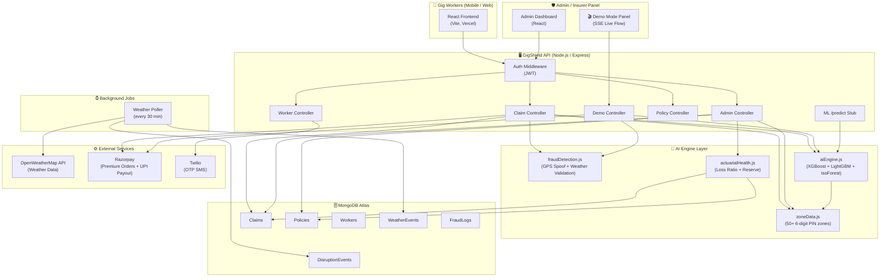
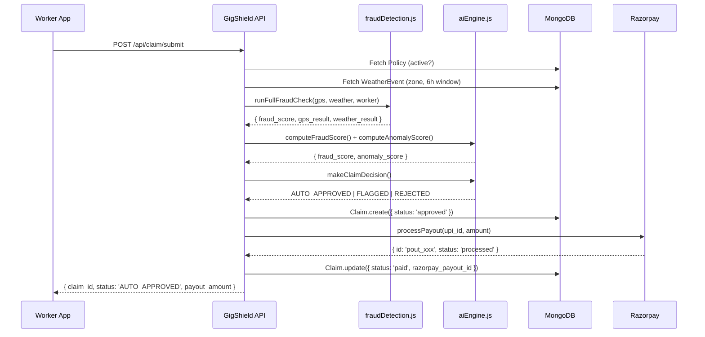

# GigShield — Architecture Diagram

> **TODO:** Export this Mermaid diagram as a PDF/PNG and include in the final submission package.

## System Architecture

## Data Flow — Claim Pipeline

## Deployment

| Component | Platform | URL |
|-----------|----------|-----|
| Frontend  | Vercel   | https://gig-shield-ten.vercel.app |
| Backend   | Render   | https://gigshield.onrender.com |
| Database  | MongoDB Atlas | (private) |
